Assessing metrics for video quality verification in Livepeer’s ecosystem
========================================================================

This is the first of a series of posts. The aim of these is to share
with the community the progress of our research effort to gather
feedback and ideas. Please share your comments and/or [fork the
repo](https://github.com/livepeer/verification-classifier) to
contribute. Let’s get to it!

As it is explained
[here](https://github.com/livepeer/research/issues/17):

> Livepeer is a protocol for video transcoding. Transcoding is a
> compute-heavy process that has traditionally carried a high technical
> and monetary cost. Livepeer aims to slash the cost of transcoding with
> an open network that incentivizes transparent competition among
> suppliers of transcoding capacity. The rules of the Livepeer protocol
> are backed by smart contracts on the Ethereum blockchain, an immutable
> ledger.

> The combination of an open, permissionless network and immutable
> non-reversibility attracts byzantine (adversarial) behavior: any
> participant can attempt to “break the protocol” without immediate
> consequences from within the Livepeer network. A verification
> mechanism is necessary to decide whether the transcoding work was done
> correctly.

Part of this contribution involves research and attempt to tackle the
problem of **verifying that the transcoded content itself is a
reasonable match for the original source given a good-faith effort at
transcoding.**

Eventually, the mission consists on developing a verification classifier
that will give a pass / fail output (and with what confidence score),
for a given segment of a given asset.

* * * * *

#### Assessing the quality of a single asset

The literature on the topic of Video Quality Assessment (VQA) is quite
vast and is out of the scope of this article to enter into deep details
about it. Interested readers are referred to other Medium publications
[here](https://medium.com/netflix-techblog/toward-a-practical-perceptual-video-quality-metric-653f208b9652)
(by Netflix) and
[here](https://medium.com/@eyevinntechnology/video-quality-assessment-34abd35f96c0).

As a foundation to our discourse, let’s agree that when a transcoded
copy of a video asset is made using lossy compression, there will be
approximations and data omissions. The evaluation of the effect of those
omissions by humans is termed Subjective Quality Assessment, and is
based on the concept of Mean Opinion Score (MOS). However, these
evaluations can be terribly tedious and time consuming, and isn’t
progress about improving people’s lives?

* * * * *

Above: two different lossly compressed versions of an original picture
(a frame from Big Buck Bunny). Definition of a criterion on what is an
acceptable quality level is not an easy task, hence the plethora of
objective quality methods attempting to measure quality.

Enter objective Objective Quality Methods. These methods, as their name
implies, attempt to make a model of the distortions incurred during the
encode /decode process and foresee the most likely MOS a piece of
(lossy) compressed video will have. They can be either based on the
[Human Visual System
(HVS)](https://en.wikipedia.org/wiki/Human_visual_system_model) or on
purely mathematical / engineering metrics, the latter being the most
widespread kind of methods with a list of variations growing by the
year: MSE, PSNR, SSIM, MS-SSIM, PEVQ, VMAF,…

Nevertheless, the aforementioned engineering / traditional metrics can
still be categorized depending on whether they are based on a full
comparison between the original and the transcoded version (**FR
metrics**), on a comparison between a reduced representation of the
original and the copy (**RR metrics**) or on a no-reference model that
seeks artifacts and other degradations only in the copy (**NR
metrics**).

For the purpose of this article and subsequents, we will abound on how
to use these metrics to approve / reject a piece of encoded video.

A first experiment to build some intuition about the problem at hand is
to depict the evolution in time of one of the metrics (say, SSIM) for a
given movie. The charts below show the iteration frame by frame over the
first 50 seconds (1240 frames) of Big Buck Bunny movie (720p@1.3Mbps),
encoded to 500 kbps and 250 kbps, respectively.

As it would be expected, lower bitrate should introduce more artifacts
and distortions, as can be seen from the fact that the 250 kbps curve
goes almost parallel to the one for 500 kbps, just with slightly lower
values, and in some specific scenes.

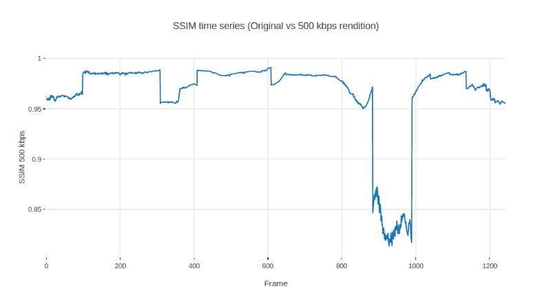

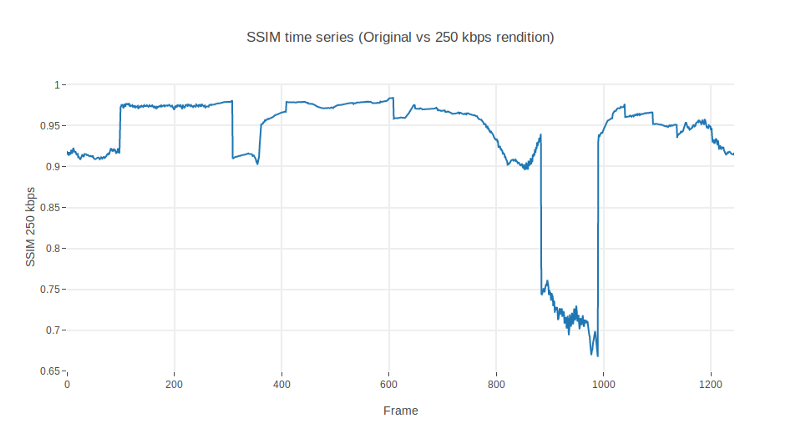

SSIM time evolution for the first 1240 frames (50 seconds) of Big Buck
Bunny, encoded at 500 kbps (above) and 250 kbps (below)

Well, this looks promising. Let’s see how much the SSIM diverges by
measuring the ratio between one another:

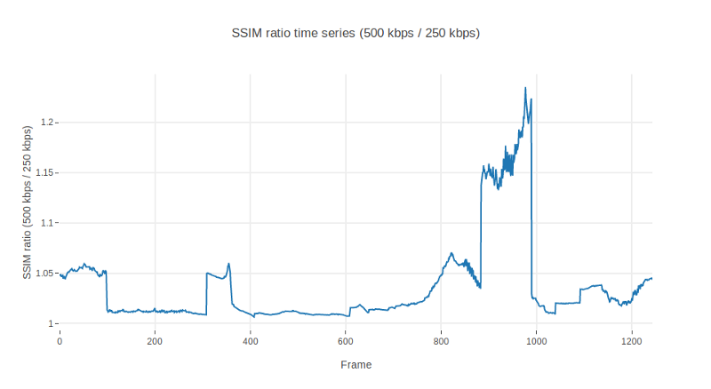

Time evolution of the ratio between SSIMs encoded at 500 kbps and 250
kbps. First 1240 frames (50 seconds) of Big Buck Bunny

Aha, a mean ratio of 3%. One would expect a fairly flat line, not ramps
and spikes, though. In future articles we may dig further on these
glitches in the frames 95, 305, 405, 605, 880 and 986. Omit them for now
if you can. Otherwise, this ratio could report to a fairly decent extent
on how much distortion the 250 kbps rendition is contributing with
respect to the 500 kbps.

Let’s see now what happens if, in a display of mischief, one includes a
watermark in the 500 kbps rendition:

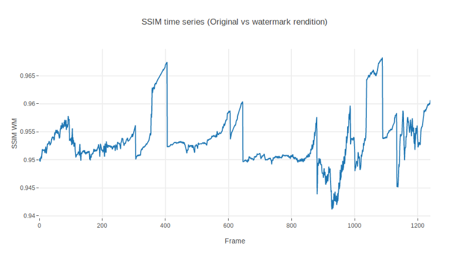

SSIM time evolution for the first 1240 frames (50 seconds) of Big Buck
Bunny, encoded to 500 kbps with a watermark

Ok, so the time series is now completely different. It would be very
difficult to use SSIM to distinguish a lower bandwidth rendition from a
watermarked rendition. The 250kbps rendition has a mean value of SSIM in
0.93 whereas the watermarked version shows a mean SSIM of 0.95.

Taking a look at the ratio between the 500 kbps and the watermarked
rendition, we find something even more astonishing. Watermarks improve
the SSIM!! (Well, in some segments at least).

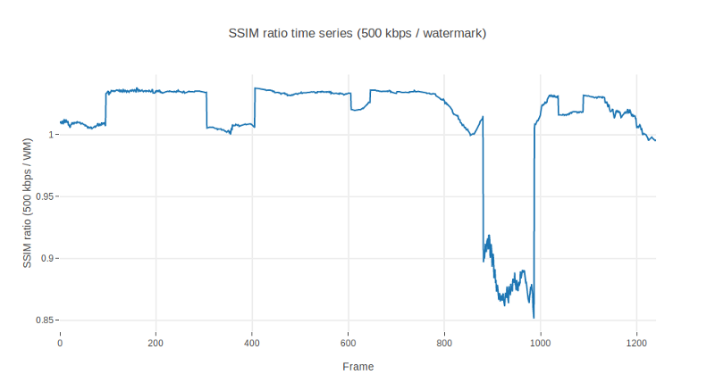

Time evolution of the ratio between SSIMs encoded at 500 kbps and with a
watermark. In some segments (ratios below 1), watermarks seem to give
even better SSIM results than the ‘*bona fide*’ rendition at 500 kbps.

Blast. Encodings with watermarks behave better than those with lower
resolutions.

In practice, this basically means that if one were to use SSIM to
establish a prescriptive threshold, this would be indeed arbitrary and
subject to debate. Even if using statistical values like average,
histograms or the like. Where is the limit? 1% ratio with respect to the
mean? Too strict. 10%? Too loose.

#### Bringing in more metrics

Let’s use yet another metric, just to evaluate if this issue only
affects SSIM. We summon PSNR, another VQA champion!

PSNR’s values have a scale different from SSIM . To begin with, they
operate in dB (logarithmic), not linear scores. Nonetheless, some
experts have defined tables that map dB to MOS. It is more or less
accepted that below 20dB is the worst quality and more than 37dB is the
highest one can perceive with the naked eye.

For our illustrative purposes, we will compare metrics as a ratio
between renditions. Figures below represent the same experiment we did
before: the ratio between the instantaneous SSIM of the 500 kbps
rendition and the 250 kbps rendition and the same between the 500 kbps
with watermark. SSIM and PSNR are superimposed to see their respective
contributions.

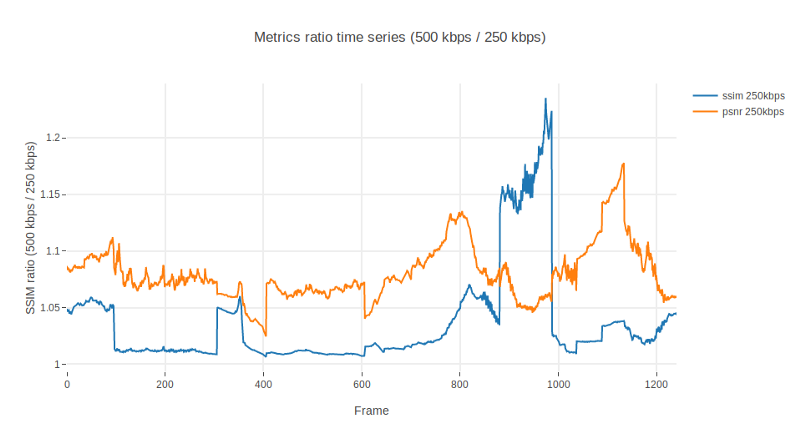

Time evolution of the ratio between SSIMs and PSNRs for encodings at 500
kbps and 250 kbps.

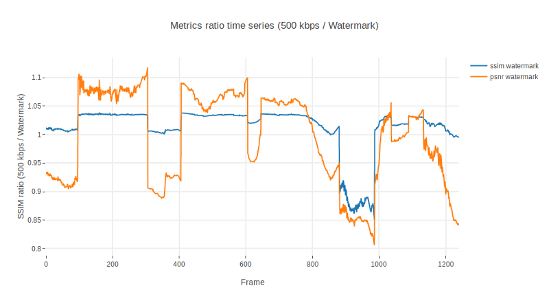

Time evolution of the ratio between SSIMs and PSNRs, encoded at 500 kbps
and at 500 kbps with a watermark.

Ahm. Well. It seems that PSNR is not adding much more information. It is
a bit more sensitive than SSIM to some scenes, amplifying the signal in
both directions, but other than that, if we were to blindly use the
average we would end up concluding again that watermarked renditions are
better than those without (which is wrong).

#### Generalizing to several assets

But, let’s see to what extent we could still use them. Let’s leave
watermarks aside. Perhaps there are upper and lower bounds to how much
these metrics vary, and see if they can still be of any use to assess
the validity of an encoding, if only to verify that an encoding is a
decent copy of an original.

We have taken a number of assets from [Youtube’s YT8M
dataset](https://research.google.com/youtube8m/download.html) and
encoded a few renditions from there. Specifically, we have taken about
140 videos from this dataset, established the 1080p rendition as
original, and encoded 10 seconds of each to 720p, 480p, 360p and 240p.
For the sake of simplicity, we have reduced the respective bitrates to
be equal to those used by YouTube for each rendition (you can find a
more detailed article on how this can be done
[here](https://medium.com/@epiclabs.io/introduction-dbf37207e2d1)).

We have also invited a few more full reference metrics to the party,
namely cosine, euclidean and hamming distances, so we add more diversity
to the analysis.

Once we have gathered our renditions, we have iterated video by video (4
renditions x 140 videos = 560 specimens) and extracted their mean PSNR,
SSIM, MS-SSIM, VMAF, cosine, Hamming and euclidean hash distances with
respect to the original 1080p rendition. Full details about this
implementation can be explored in the github repo we have enabled
[here](https://github.com/livepeer/verification-classifier). Yet another
caveat: the segments were chosen rather arbitrarily: 10 seconds (240 to
300 frames) from the middle of the video’s timeline. What if those
segments happen to be non-representative of the whole video? They could
depict a static scene with very low variation of colors, or otherwise
fall in the middle of an epic battle with lots of motion. This is known
to severely affect the output quality when bitrate is constant, hence
the likelihood of an encoded job of being rejected even if properly
done.

With this substantial amount of data, we can proceed to evaluate how
different metrics relate to each other. A bit of EDA (Exploratory Data
Analysis) might bring in some hindsight as to how metrics relate to each
other. Matrix below depicts a pairs plot of our newly generated dataset.
It builds on two elementary plots: scatter plots of one metric against
each other and histograms of themselves in the diagonal. We can see that
all distances (euclidean, cosine and Hamming) are linearly related,
meaning basically that they could be used almost interchangeably. On the
other hand, SSIM and PSNR are also somehow correlated in a logarithmic /
exponential manner, but inversely with regards to the hash distance
metrics. In a world apart, the more sophisticated MS-SSIM and VMAF
present some degree of connection between them, and display a similar
pattern as SSIM in their lower bound with regard to the hash distance
metrics.

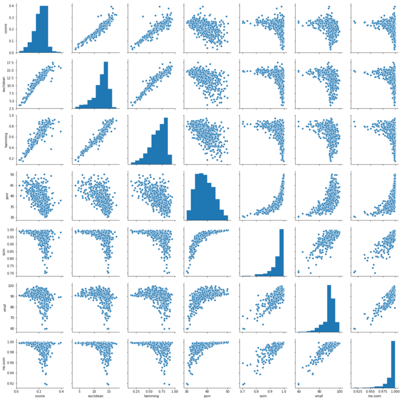

Pairs plot for our dataset of 140 Youtube clips. Distance metrics
(cosine, euclidean and Hamming) are fairly linearly correlated, whereas
SSIM and PSNR show some logarithmic / exponential relationship with each
other. VMAF and MS-SSIM also have some degree of linear correlation to
each other. MS-SSIM appears as the one with the most compact
distribution.

The intensity of this correlation is given by the [Spearman’s
correlation
coefficient](https://en.wikipedia.org/wiki/Spearman%27s_rank_correlation_coefficient)
displayed in the table below. Without entering into details, let’s
explain that Spearman’s correlation coefficient gives the same
information as that of
[Pearson](https://en.wikipedia.org/wiki/Pearson_correlation_coefficient)’s,
but calculated on ranks instead of actual data values. This allows for
identification of both positive (blue) and negative (red) correlations,
where +1 means total positive correlation (when one feature grows, so
does the other) and -1 means total negative correlation (when one
feature grows, the other decreases).

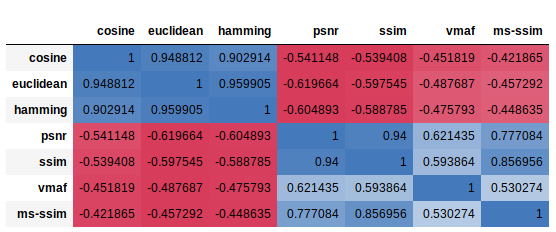

Spearman correlation table for all seven metrics used in our analysis

From
[Wikipedia](https://en.wikipedia.org/wiki/Spearman%27s_rank_correlation_coefficient):

> The sign of the Spearman correlation indicates the direction of
> association between *X* (the independent variable) and *Y* (the
> dependent variable). If *Y* tends to increase when *X* increases, the
> Spearman correlation coefficient is positive. If *Y* tends to decrease
> when *X* increases, the Spearman correlation coefficient is negative.
> A Spearman correlation of zero indicates that there is no tendency for
> *Y* to either increase or decrease when *X* increases. The Spearman
> correlation increases in magnitude as *X* and *Y* become closer to
> being perfect monotone functions of each other.

Summa sumarum, the above is basically telling us that to some extent all
seven metrics would provide a fairly similar information once those
relationships would be substantiated and disentangled by means of some
mathematical sorcery.

On the other hand, one might want to see which metric has the lowest
variance, hence giving a better approximation to the definition of
strict thresholds. The histograms displayed in the diagonal of the pairs
plot point MS-SSIM as the best candidate, with a lower bound somewhere
in the 0.925 MS-SSIM points. There are some outliers, though, worth
checking in order to further understand why they have such “bad”
behavior.

In order to find out who are these outliers and why some assets present
values of MS-SSIM below 0.975, we can plot the different metrics values
against their rendition identifier. Each of the following charts
displays the mean value of the respective metric for 10 seconds for all
the different encodings we made. So, basically, for each asset we have
four points. One for each rendition. Note that not all of them have a
rendition in the 426:240, 640:360, 854:480, 1280:720, but doesn’t make
them outliers. We are interested in the metric value, not the
dimensions.

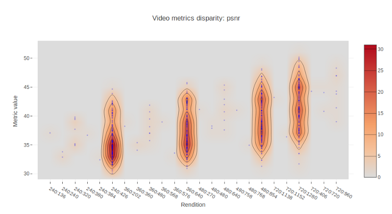

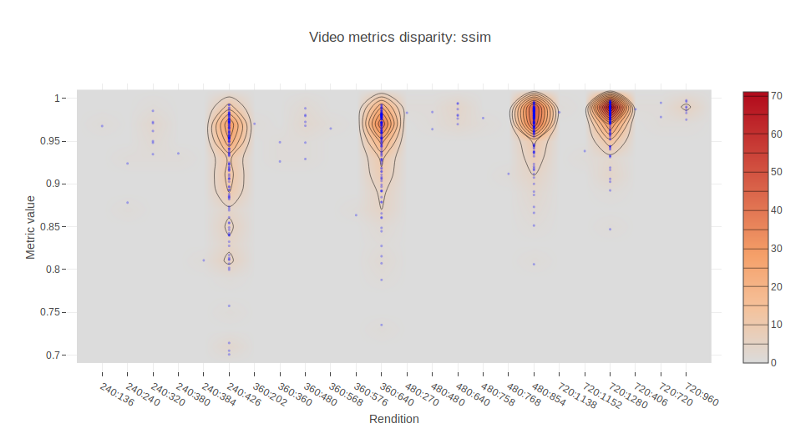

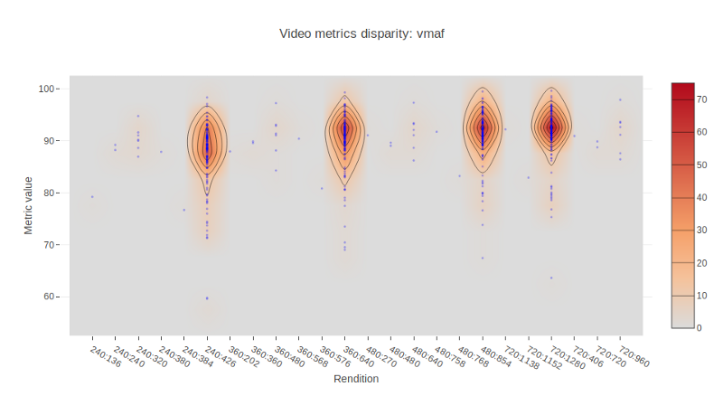

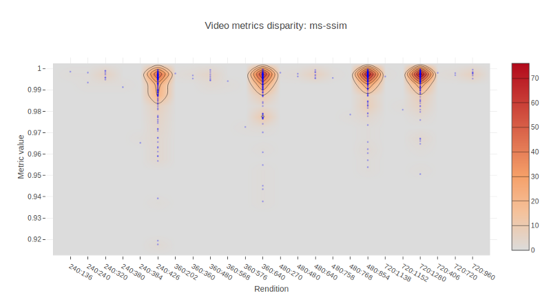

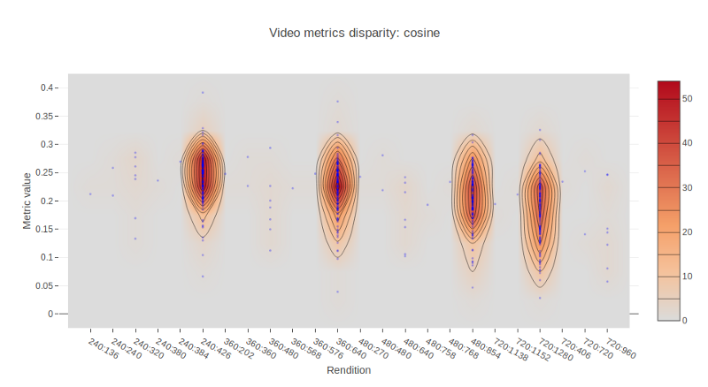

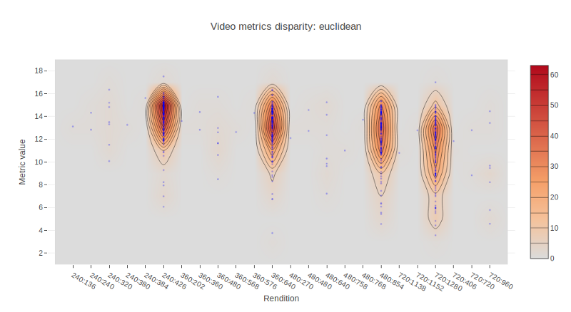

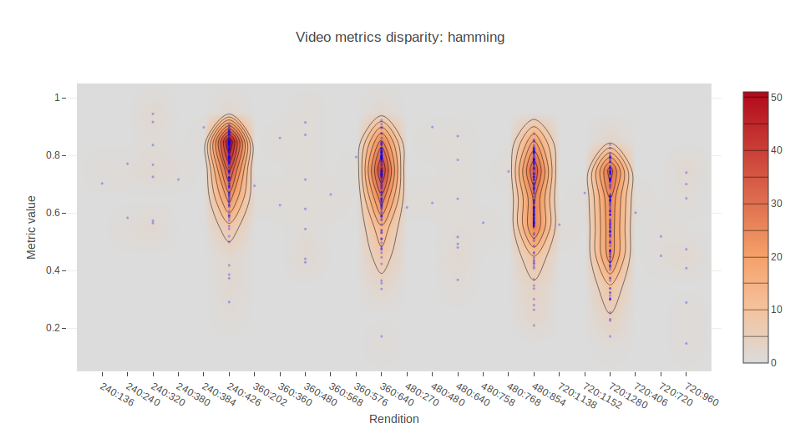

This allows us to locate outliers and inspect them further. In the
Jupyter notebook provided in the repository, this can be easily done by
means of Plotly and hovering the cursor over the points.

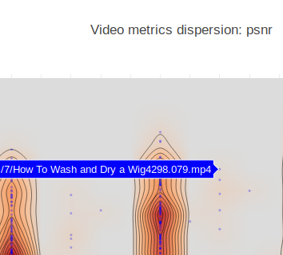

…and here we go. One frame of one of the samples that lie outside of the
crowd is presented below. This video shows people jumping form the rocks
into water and having their fun in what is seemingly a very complex
asset, both in the dynamics through time as well as in the spatial
relationships and pixel textures.

Frame from one of the outliers. The video presents a high amount of
motion and high detail hard to deal with for the codec in a reasonable
compression rate.

So, what does this mean? Only simple videos would pass a filter based on
the average of a metric? We need to establish a somewhat more
sophisticated metric that takes into account both the relative reduction
in quality as well as the complexity in time and space.

#### Conclusions and further work

Ok, so. Objective Full Reference metrics alone cannot be used in
isolation or grouped to define thresholds for acceptance / rejection.
There are several problems associated with them.

In the first place, there seems to be provable that all of them supply
the same or almost the same information (see the correlation table
above) in one or another way.

Second, once we have agreed that we could establish a threshold under
which measured distortion is not acceptable (for example, 0.97 MS-SSIM
points), still other forms of attack are possible (i.e. watermarks).

Third, for complex videos the threshold might result too restrictive for
acceptably well encoded renditions.

How do we proceed then?

One potential option is to tackle the problem from another angle, using
No Reference metrics applied over both the original and the copy, then
comparing. Another line of research would involve creating adaptive
thresholds that would take into account the spatial and temporal
activity levels of an asset. Yet another thread might lead us to simply
create a neural network with annotated assets and define by ourselves
different kinds of attack (poor resolution, watermark, etc).

This is getting interesting! Stay tuned for follow-up posts on this
exciting research project!

#### References 

[**Livepeer**](https://github.com/livepeer)

[**epiclabs-io/YT8M**](https://github.com/epiclabs-io/YT8M)

[**Toward A Practical Perceptual Video Quality Metric**](https://medium.com/netflix-techblog/toward-a-practical-perceptual-video-quality-metric-653f208b9652)

[**Video Quality Assessment**](https://medium.com/@eyevinntechnology/video-quality-assessment-34abd35f96c0)

[**Human visual system model — Wikipedia**](https://en.wikipedia.org/wiki/Human_visual_system_model)

[**YouTube-8M: A Large and Diverse Labeled Video Dataset for Video Understanding Research**](https://research.google.com/youtube8m/download.html)

#### About the authors

[Rabindranath](https://www.epiclabs.io/member/rabindranath/) is a PhD in
Computational Physics by the UPC and AI researcher.
[Dionisio](https://www.epiclabs.io/member/dionisio/) is a Computer
Science Engineer by the UPM specialized in Media. Both are part of
[Epic Labs](https://www.epiclabs.io/), is a software innovation center for
Media and Blockchain technologies.

[Livepeer](https://livepeer.org/) is sponsoring this project with Epic Labs
to research ways to evaluate the quality of video transcoding happening
throughout the Livepeer network. This article series helps summarize our
research progress.