Assessing metrics for video quality verification in Livepeer’s ecosystem (II) {#80a8 .graf .graf--h3 .graf--leading .graf--title name="80a8"}
=============================================================================

In a previous article
([here](https://medium.com/@epiclabs.io/assessing-metrics-for-video-quality-verification-in-livepeers-ecosystem-f66f724b2aea))
we explored the possibilities of Full Reference Video Quality Assessment
([VQA](https://medium.com/@eyevinntechnology/video-quality-assessment-34abd35f96c0))
metrics for verifying that a transcoded video sequence is a reasonable
match for an original source given a good-faith effort at transcoding.

More specifically, we evaluated the discriminating ability of average
[VMAF](https://github.com/Netflix/vmaf),
[MS-SSIM](https://en.wikipedia.org/wiki/Structural_similarity),
[SSIM](https://en.wikipedia.org/wiki/Structural_similarity),
[PSNR](https://en.wikipedia.org/wiki/Peak_signal-to-noise_ratio) and the
cosine, euclidean and Hamming distances of a [hashed version of the
frames](https://towardsdatascience.com/fast-near-duplicate-image-search-using-locality-sensitive-hashing-d4c16058efcb).
It was explained that, even though some of these metrics can provide
valuable information as to how similar each transcoded frame is to the
original (in average), it is not possible to ascertain with absolute
confidence that the whole sequence belongs to the given original source.

In summary, those metrics only assess the similarity in terms of spatial
features (pixels) in a frame-to-frame basis, at each time step. By
simply averaging their values throughout the whole sequence we are
omitting valuable information that could otherwise be used to uniquely
identify a video asset and its renditions.

In this article we will approach the problem exploiting the temporal
similarities between a video original and its copies.

#### Measuring a video’s temporal activity levels

As it is nicely explained
[here](https://github.com/leandromoreira/digital_video_introduction#4th-step---quantization),
the compression ratio of an encoding not only depends on the spatial
relationships between pixels but also on the ability of the encoder to
make predictions as to how those pixels will change in future frames.
Hence, higher amounts of motion involve either higher bitrates or lower
perceived quality.

Have a look at the frame below. Black pixels represent no-change with
respect to the next. White and grey ones are different inter-frame
pixels. Counting non-zero pixels (not black) gives us an exact idea of
the rate of change at every instant. The image has 1280 x 720 (921600)
pixels. The number of non-zero pixels is 543744. This basically means
that 59% of the pixels of the frame 31 are different from the frame 32.

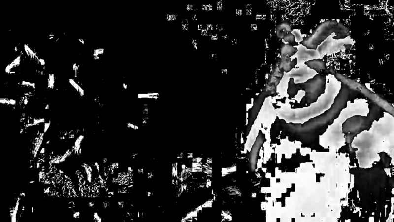

Frame 31 of Big Buck Bunny, as the difference between itself and
the next

In the figure below, we can observe the time series evolution of the
change between one frame and its subsequent for the first 50 seconds of
[Big Buck Bunny](https://peach.blender.org/). We have computed it as a
ratio between the number of pixels of a frame and the count of pixels
with a non-zero value after subtraction of the next frame (see image
above: the ratio between all the pixels of a frame and those which are
not black, one frame at a time).

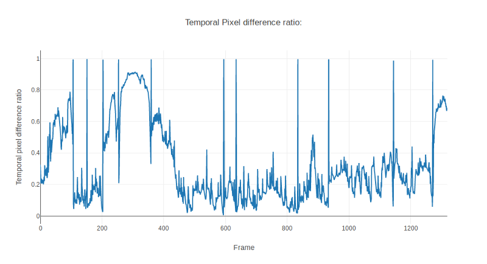

Time series for the evolution of the temporal pixel difference ratio for
the first 50 seconds of Big Buck Bunny

This chart shows very clearly those frames where a scene changes (100%
difference ratio), and also those scenes where the amount of pixel
motion is higher. Between frames 200 to 300, action fluctuates and
increases at the beginning with camera motion but then from around frame
450 and beyond planes are mostly static with only characters changing
positions.

#### Finding similarity patterns in time series

So, wow, if we were to apply the above procedure to different encodings
of the same asset, we could detect whether their rates of change have a
similar march as that of the original, right?

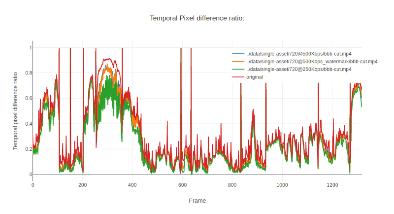

Time series for the evolution of the temporal pixel difference ratio for
50 seconds of Big Buck Bunny and different renditions

And indeed they do! Does it mean we can calculate their similarity as an
average of this ratio? Ahem, well, we could. But doing so, we would
again be facing the same problem as we did in our previous article.
Averages make it very bad at creating absolute thresholds. They
basically leave everyone dissatisfied (see the [Flaw of
Averages](https://herdingcats.typepad.com/my_weblog/2015/08/the-flaw-of-averages.html)
for further reading).

Instead of means, we will be using distances between vectors. The time
series displayed above can also be treated as a sequence of values
(which are basically vectors):

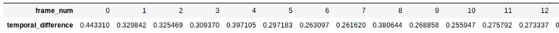

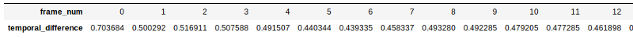

From Wikipedia,

> the **Euclidean distance** or **Euclidean metric** is the “ordinary”
> [straight-line](https://en.wikipedia.org/wiki/Straight_line "Straight line")
> [distance](https://en.wikipedia.org/wiki/Distance "Distance") between
> two points in [Euclidean
> space](https://en.wikipedia.org/wiki/Euclidean_space "Euclidean space").

Essentially, this metric takes the difference between every pair of
elements of our two lists by subtracting one from each other, ensures
that it is positive (by squaring it), adds the subtractions all up and
then makes the square root. Fairly simple, right? By computing the mean
we would simply add up all the values, then divide them by the number of
items in the array and then, in order to compare, we would subtract one
from another.

The advantage will become more evident in the charts below. For the sake
of better visualization, let’s first reduce the noise introduced by the
high frequencies of our plot and smooth our curves down a bit:

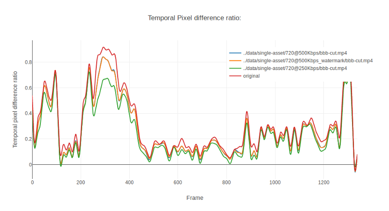

Time series for the evolution of the temporal pixel difference ratio for
the first 50 seconds of Big Buck Bunny and different renditions,
smoothed down with a Fast Fourier Transform filter

That’s much nicer looking now. The patterns of evolution stand out more
clearly for all three renditions. If we were to compute the mean, we
would have four lines running straight more or less through the middle
of the chart. By using the Euclidean distance, in this case, the result
would be similar because all four lines run more or less parallel.
However, when an outlier appeared, it would be much easier to spot, as
differences are magnified by those quadratic terms of the Euclidean
metric.

This looks very promising. Let’s see how well we can detect stowaway
renditions with these new approach of counting non-zero pixels. Instead
of Big Buck Bunny, now we will be using a different asset, a randomly
picked specimen from our YT8M dataset:

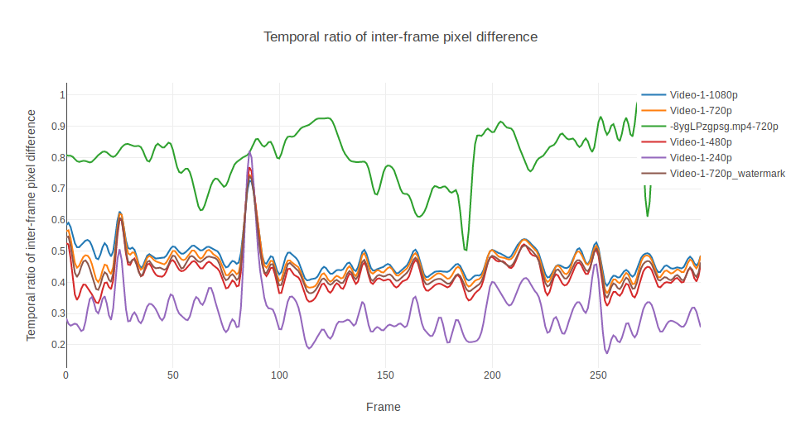

Temporal pixel difference time series for 300 frames of five renditions
of YT8M’s videos. Green line corresponds to an outsider.

We have inserted in our rendition list a video from another asset,
simulating a pre-cooked rendition (with similar bitrate and identical
resolution) meaning no computing effort from the transcoder’s side. The
pattern becomes pretty obvious, right? (Yes, the attack is the green
line ;)).

Apparently, all that is needed now is a mathematical tool that would
supply us a number accounting for what emerges self-evidently to the
human eye. Using a mean for it would probably turn the green line into a
point (around 0.8) sensibly different from the rest. But what about
those assets whose mean is lower?

If we treat the whole time series as a vector, we can measure the
distances to the original in a n-frames dimensional space. In our
previous article, for each frame, we re-scaled and hashed both the
original and the rendition and measured their distances, obtaining a
mean value throughout the whole sequence. This is not to be mistaken
with what we are doing in this experiment: now we are measuring the
distance between two vectors all together (the points in the time
series). Each element of the vector contains the difference between a
frame and its following from the beginning to the end of the asset
segment. We show below results for Euclidean and Cosine distances for
all the time series depicted above:

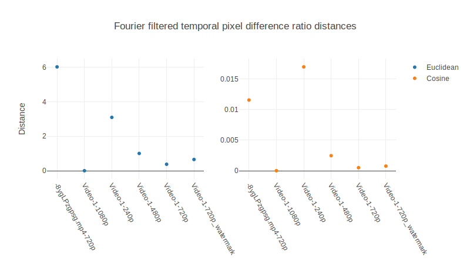

Cosine and Euclidean distances for each time series depicted above with
respect to the original (Video-1–1080p). The stowaway rendition
(-8ygLPzgpsg.mp4–720p) can be easily spotted by means of its Euclidean
distance to the original. Watermark, however, seems a bit harder.

Note how outlier rendition (-8ygLPzgpsg.mp4) has noticeably the largest
value for Euclidean distance, although if we were using the Cosine
distance, we could mistakenly discard a valid 240p rendition (see
[here](http://dataaspirant.com/2015/04/11/five-most-popular-similarity-measures-implementation-in-python/)
why).

Well, now we have something. Outsiders are easily detected. Euclidean
distance of temporal inter-frame difference is easily computed (and, by
the way, much faster than using SSIM, MS-SSIM or VMAF), and gives us
larger distances for renditions whose distortion is higher. We can leave
aside other kinds of distances, like Cosine, because, compared to
Euclidean, they seem to make a meager contribution to our pursuit.

Nevertheless, we are still facing similar problems as we did regarding
our traditional VQA metrics. The average value for a good faith low
bitrate encoding (240p) lies further away than a malicious watermark
attack. Let’s take a closer look:

A closer look at five renditions of the same asset and an interloper (
-8ygLPzgpsg.mp4). The orange line corresponds to a legitimate encoding.
Also the red and purple. The green line correspondent to the stowaway
rendition has already been spotted. However, the brown line identifies a
watermarked rendition. Even using distances, it wouldn’t be easy to
discriminate the good from the bad.

See? The orange, red and purple lines correspond to renditions that have
been scaled down (720p, 480p and 240p) and given a slightly lower
bitrate. Naturally, a certain amount of distortion might be expected.
However, the orange line belongs to a rendition with a watermark!
Moreover, if we were to make the same analysis with a rendition whose
frames were flipped, or rotated, they would still account for exactly
the same amount of non-zero pixels (more or less, subject to slight
fluctuations in the output bitrate selected by the encoder). Let’s see.

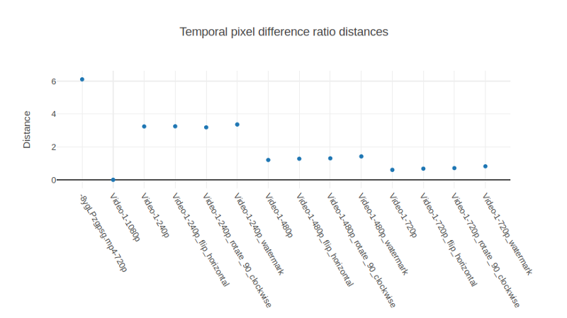

Euclidean distances for a number of different attacks. Euclidean
distance between original inter-frame difference time series spots with
certain confidence fake video sequence. However, we need to work harder
to discriminate other types of attack.

We have taken the same asset as previously and generated a few more
abject renditions where frames were rotated and flipped. Chart above
displays how they group as lower resolutions incorporate a higher degree
of distortion, the 240p being the worst. With our newly described
technique of measuring Euclidean distances between temporal differences
we remain unable to separate another type of attacks: those with high
similarity.

Let’s not surrender just yet. There has to be something we can do about
those nasty renditions. Remember the PSNR? It gives a more elaborated
summary than the simple pixel difference. What if we use it to measure
how much distorted one copied frame is with respect to its original
previous? Let’s picture the time series for it.

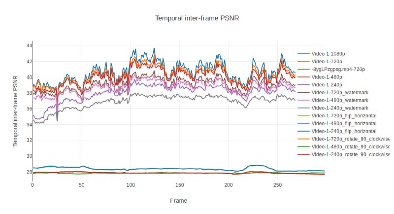

Time series for the PSNR between original asset and its

There we go! Now not only interlopers are discriminated, but also other
kinds of misdeeds such as flips and rotations. We can have a a look at
the computed Euclidean distances between time series:

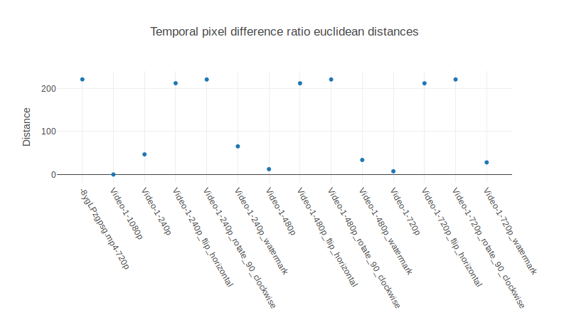

Euclidean distances for each rendition measured over the time series
vector of the PSNR. Now outliers and distorted renditions clearly
separate from rightful encodings. Watermarks are still an issue, though,
as their difference is too subtle to be delimited with a single
threshold.

Unlike the computation of the mean we performed in the previous article,
where original frames were compared against their corresponding
counterpart encoded frames, here we are comparing the original frame
against the ***next*** corresponding frame of the copy. This gives us
two bundles of information in a single model: the rate of change of the
asset and the amount of similarity of its copy.

Not bad. We are getting very close. The path seems to be narrowing down
for many unwanted attacks. If only we could spot away watermarks in a
holistic manner, it would be just great. Actually, the problem seems to
reduce to find a non-linear discriminating line. Did anyone mention
there a Neural Net?

In fact, we now have created a reliable and potentially rich vector of
features (the temporal evolution of the PSNR) that we could feed into a
Neural Network and see if with enough assets there is a pattern that can
be exploited to discriminate this kind of attack (and why not, any
others).

#### Conclusions and further research

We have seen how temporal qualities can be used to uniquely identify a
video asset and its renditions. The time series vector seems to provide
information with somehow better quality than simple statistical metrics
such as the mean.

We have introduced a metric slightly different from PSNR to assess video
quality: the Euclidean Distance for Temporal Inter-Frame PSNR, which
falls into the Full Reference category of VQA metrics.

One step of this metric, the preparation of the temporal inter-frame
PSNR, will be used in a future article to feed the input of a neural
network in order to discriminate whether a rendition has been attacked.

Stay tuned!

#### References

[**leandromoreira**](https://github.com/leandromoreira/digital_video_introduction#4th-step---quantization)

[**Big Buck Bunny**](https://peach.blender.org/)

[**The Flaw of Averages**](https://herdingcats.typepad.com/my_weblog/2015/08/the-flaw-of-averages.html)

[**Fast Fourier transform — Wikipedia**](https://en.wikipedia.org/wiki/Fast_Fourier_transform)

[**Five most popular similarity measures implementation in python**](http://dataaspirant.com/2015/04/11/five-most-popular-similarity-measures-implementation-in-python/)

#### About the authors

[Rabindranath](https://www.epiclabs.io/member/rabindranath/) is a PhD in
Computational Physics by the UPC and AI researcher.
[Dionisio](https://www.epiclabs.io/member/dionisio/) is a Computer
Science Engineer by the UPM specialized in Media. Both are part of
[Epic Labs](https://www.epiclabs.io/), is a software innovation center for
Media and Blockchain technologies.

[Livepeer](https://livepeer.org/) is sponsoring this project with Epic Labs
to research ways to evaluate the quality of video transcoding happening
throughout the Livepeer network. This article series helps summarize our
research progress.