Assessing metrics for video quality verification in Livepeer’s ecosystem (III)
==============================================================================

> Livepeer is a protocol for video transcoding. Transcoding is a
> compute-heavy process that has traditionally carried a high technical
> and monetary cost. Livepeer aims to slash the cost of transcoding with
> an open network that incentivizes transparent competition among
> suppliers of transcoding capacity. The rules of the Livepeer protocol
> are backed by smart contracts on the Ethereum blockchain, an immutable
> ledger.
> The combination of an open, permissionless network and immutable
> non-reversibility attracts byzantine (adversarial) behavior: any
> participant can attempt to “break the protocol” without immediate
> consequences from within the Livepeer network. A verification
> mechanism is necessary to decide whether the transcoding work was done
> correctly.

In a quest to define an algorithm that would help [Livepeer](https://livepeer.org/#) include such mechanism, at [Epiclabs](https://www.epiclabs.io/) we are making some progress as can be seen in our previous two articles in this series (see [article I](https://medium.com/@epiclabs.io/assessing-metrics-for-video-quality-verification-in-livepeers-ecosystem-f66f724b2aea) and [article II](https://medium.com/@epiclabs.io/assessing-metrics-for-video-quality-verification-in-livepeers-ecosystem-ii-6827d093a380)).
For the present story, we will dive further into a set of metrics that will configure the input vector for a number of machine learning algorithms whose entrails we will rake in our next redaction.
So far we have explained how measuring different values on a per-frame basis can be very useful to create rich feature vectors that can later be fed in machine learning algorithms. The need for such techniques roots in the non-linear nature of our problem. There is not a single metric of similarity that can be used to discriminate all forms of poorly executed renditions. There is not even certainty about what are all the possible attacks.
What follows is an illustration of sixteen measurements we will be doing over our video renditions: four of them in a per-frame basis and then, for each, four more metrics in their time domain. 
In the spatial, frame domain, we will be observing four aspects of a video: 
Inter-frame RGB histogram distance between original and rendition, to observe color distortions
Inter-frame contour difference between original and rendition, to observe and highlight highly contrasted regions
Inter-frame normalized cross-correlation, to observe structural distortions
Inter-frame Discrete Cosine Transform difference, to assess how much energy is lost between renditions

Once those metrics are computed for each frame of a rendition, we will be able to assemble them in a time series. From this sequence of values we will extract four main aggregating values:
Euclidean distance between the original's sequence and that of the rendition
Standard deviation
Manhattan distance
Mean value

This should give us enough information about an asset and its rendition and give us the ability to discriminate by means of a classifier whether we are dealing with a legitimate encoding work or a cheating attempt.

#### Counting colors: Inter-Frame Histogram Distance (IFHD)

For this metric, we will be measuring the distance between the RGB
histograms of the frames in the original from those in the rendition.
Histograms are collected *counts* of data organized into a set of
predefined *bins*.

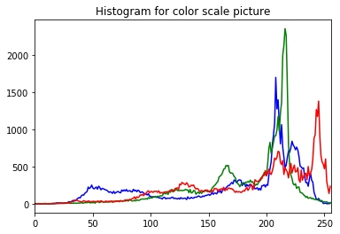

A histogram of the three RGB channels of a single frame. The picture has
53940 pixels (310x174), each with three values (R, G and B) ranging
between 0 and 255. A histogram is a convenient way to tally them.

We compute their histograms for all channels (R, G and B), so that we
can evaluate the chi square distance between them and their rendition’s
counterpart. For those interested in how this distance is computed, some
valuable links are
[here](https://docs.opencv.org/2.4/doc/tutorials/imgproc/histograms/histogram_comparison/histogram_comparison.html)
and
[here](http://www.indjst.org/index.php/indjst/article/viewFile/86808/66579). To see how it is implemented in Livepeer, have a peek [here](https://github.com/livepeer/verification-classifier/blob/master/scripts/asset_processor/video_metrics.py).

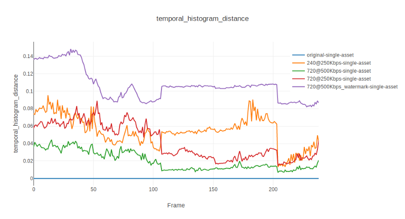

Time series for five renditions processed with our inter-frame histogram distance metric (the original being the constant blue line at zero). Given that this is a distance, larger values imply higher distortion. Watermarked renditions are now easier to discriminate and they are contrasted even from lower resolution renditions.

A temporal evolution of this metric for 10 seconds of a few renditions of Big Buck Bunny can be checked out above. In general, legitimate renditions seem to cluster nicely without great divergence, whereas watermarked encodings split almost one order of magnitude apart, at least for this asset. Being a distance between histograms, this is a metric of difference, with a lower bound in zero and unbounded in the upper extreme.
The gap between plots above depends greatly on the color and size of the watermark, not its shape, so a different kind of metric might be needed to account for other features of other videos: enter the Inter-Frame Contour Difference.

#### Counting contour pixels: Inter-Frame Contour Difference (IFCS)

So, the color change between frames is by all means a valuable source of information. However, there are other characteristics of a video sequence  that can be collected without much computational effort.
Edge detection is a technique that allows for extracting structural information based on the detection of edges. In our case, it can be very useful for detecting superimposed text and other non-texture dependent distortions. Different algorithms exist that extract this kind of information, namely Sobel's, Laplacian operator's or Canny's. After some performance benchmarking, we decided for Canny's.
Basically, we will be computing the difference between a frame in the original and its *next frame in the rendition*, obtaining a specific time series evolution vector. Previously, the frame in the original and that of the rendition have been converted to their contour version by means of a [Canny filter](https://en.wikipedia.org/wiki/Canny_edge_detector).
As an example, the results of the filter applied to both the original as well as to the watermarked rendition are displayed below.

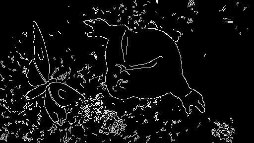

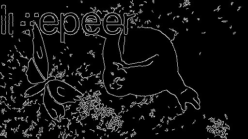

Shape contour version of a frame of an original asset (above) and
the next frame in the watermarked version (below). Watermarks have very
specific edges easily detected by Canny filters.

Once we have the contours, we can compute their difference and magnify
those pixels that are different with a dilate filter. Counting non-zero
pixels is then done in the original sequence between a frame and its
following, and then between the same frame of the original and the next
one in the copy. The arithmetic subtraction between pixel ratios (that
of the original minus that of the rendition) accounts for how much a
rendition is distorted.

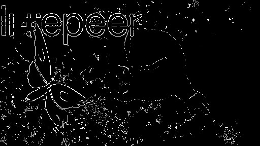

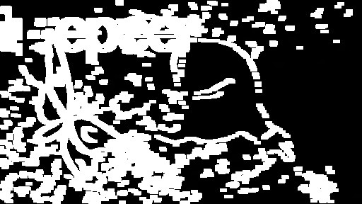

Pixel difference between a frame of an original asset and the next frame
in the watermarked version (above), and its dilated version (below).
Dilation magnifies the presence of watermarks.

This can be better understood by means of the sequence below. It shows
the contour versions of both the original asset and its rendition (steps
1 to 3) by means of a Canny filter. Then, applying a dilation filter,
disaccords are magnified (steps 4 and 5). The count of non-zero pixels
between original and rendition should be larger when watermarks are
present. We can estimate this by computing the ratio of non-zero pixels
between frames.

​(0) Get the original (frames n to n+5)

​(1) Original (frames n to n+5) with Canny filter applied

​(2) Original (frames n+1 to n+6) with Canny filter applied

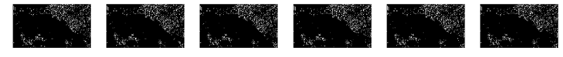

​(3) Watermarked rendition (frames n+1 to n+6) with Canny filter applied

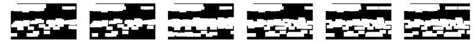

​(4) Difference between Canny version of **original** **at n**and Canny
version of **original at n+1, dilated**

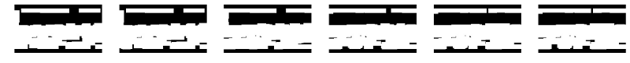

​(5) Difference between Canny version of**original at n** and Canny
version of**watermarked rendition at n+1, dilated**

When the studied asset is the original itself, the subtraction of the ratio of the rendition from the original has a constant value of 0, given that the number of nonzero pixels between the current and the next frame is the same all the time. When the rendition has watermarks, its time series diverges sensibly, given the magnification effect of the dilation filter. Do you spot it in the chart below? To see how we are putting it all together in Livepeer, have a glance [here](https://github.com/livepeer/verification-classifier/blob/master/scripts/asset_processor/video_metrics.py)

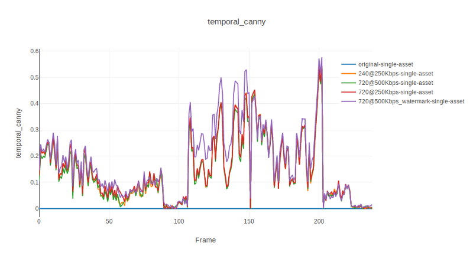

Time series for five renditions processed with our Canny inter-frame difference ratio metric (the original being the constant blue line in zero). Given that this is a difference metric, larger values imply higher distortion. The watermarked rendition has a similar time evolution but a constant higher mean.

The closer we are to 0, the lower is the effect of distortions in the signal. Those spikes between the frames 100 to 200? They imply a very high number of nonzero pixels between the original and the rendition. This metric is bounded between zero and one, giving an idea on how different from each other two renditions are, as opposed to a similarity metric (i.e. the inverse).

#### Measuring differences in energy: Inter-Frame Discrete Cosine Transform Difference (IFDCTD)

Extracting information about the color and the shapes in our frames seems to do a great job, but how about those assets where the textures are very rich? The contours might *dissolve* in a wealth of gradients. Or what if the watermark is not big enough? The inter-frame difference might become negligible Would it work as nicely?
In image processing, the energy measures the localized change of the image. It gives a notion of the rate of change in the color/brightness/magnitude of the pixels over local areas. As such, it summarizes to a great extent how pixels in an image relate to each other. There's a number of different explanations of what the energy of an image is but in essence they all refer to the sort of "sexiness" of the image.
A well known technique to represent this energy is Discrete Cosine Transform (DCT). Besides, DCT has very good energy-compaction properties, which means that it concentrates most of the energy in the first few coefficients of the transform. It is somehow similar to the Fast Fourier Transform in what it retrieves the frequency domain relationships from its spatial relationships. More details can be encountered [here](https://users.cs.cf.ac.uk/Dave.Marshall/Multimedia/node231.html) and [here](https://en.wikipedia.org/wiki/Discrete_cosine_transform#Applications).

For our purposes, be enough to consider DCT as another 'information compressing' technique, from which we can compare the difference in energy between two frames: that of the rendition against that of the original. Those who want to see the source code in Livepeer can do so [here](https://github.com/livepeer/verification-classifier/blob/master/scripts/asset_processor/video_metrics.py).

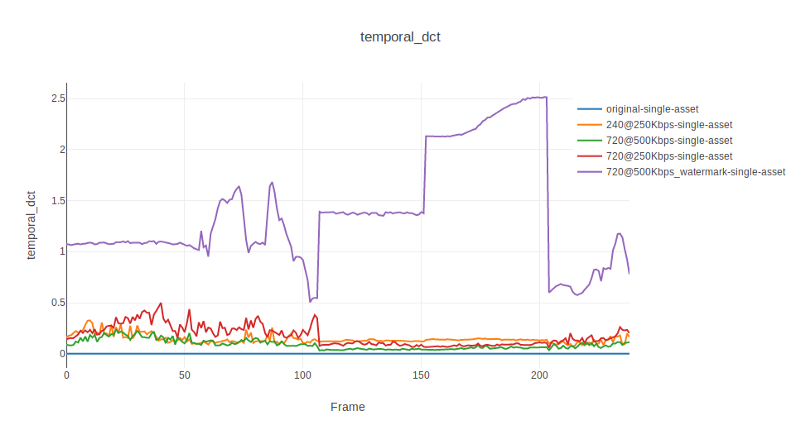

Consider DCT as another 'information compressing' technique, from which we can compare the difference in energy between two frames: that of the rendition against that of the original. Given that we are converting it into a distance metric, larger values imply higher distortion.

#### Measuring texture: Inter-frame normalized cross-correlation (IFNCC)

So, by now we have evaluated how much a rendition's color distribution, edges and crispness  match but, how about the textures? That can be very informative, too. Still in the spatial domain, we can use some form of comparison, frame by frame, on how much their textures match. Behold! [Template Matching](https://opencv-python-tutroals.readthedocs.io/en/latest/py_tutorials/py_imgproc/py_template_matching/py_template_matching.html!

Template matching is a technique used in computer vision to find and locate patterns in larger images. It basically scans the target image with the pattern image in a sliding window fashion measuring the highest value by means of different statistical methods.

OpenCV's template matching. A sliding window of the pattern image is swept over the target image. In our case, our pattern image is the rendition's frame, and the target image is the original frame. Source: OpenCV documentation

In our implementation, we will be using an algorithm based on the [normalized cross-correlation](https://en.wikipedia.org/wiki/Cross-correlation) between pixels in the original asset and their rendition counterpart. To serve our purposes, our pattern to search will be the whole rendition frame, within the original frame. More details about its formula and how it  is computed  can be found [here](http://scribblethink.org/Work/nvisionInterface/nip.html), [here](https://scikit-image.org/docs/dev/auto_examples/features_detection/plot_template.html)
and [here](https://opencv-python-tutroals.readthedocs.io/en/latest/py_tutorials/py_imgproc/py_template_matching/py_template_matching.html).

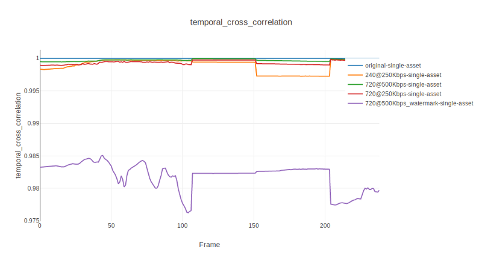

Time series for five renditions processed with our cross-corrrelation similarity ratio metric (the original being the constant blue line in zero). Given that this is a similarity metric, larger values imply less distortion, zero being totally different. The watermarked rendition has a remarkably different time evolution and an even more accented mean value.

In the chart above, it is again remarked how different renditions have different temporal development. Most importantly, our watermarked rendition stands out by a large margin, even though the temporal pattern (its up and downs, i.e. its derivative) have a great similarity. This is a measure of similarity, bounded between zero and one, with higher values meaning higher degree of similarity (or correlation).

#### Aggregating time series: temporal domain metrics of spatial domain metrics

So far we have explored instantaneous inter-frame metrics that compare frame by frame in their spatial relationships. We need however a single number that "compresses" the whole time series and characterizes each rendition with as few loss of information as possible.

As we saw in our [previous article](https://medium.com/@epiclabs.io/assessing-metrics-for-video-quality-verification-in-livepeers-ecosystem-ii-6827d093a380),
**mean values** alone not always do a very good job on this sense. [**Euclidean distances**](http://dataaspirant.com/2015/04/11/five-most-popular-similarity-measures-implementation-in-python/) between the time series of the original and the rendition proved to bottle up more information as to how much different two time sequences are. On the other hand, [**standard deviation**](https://www.mathsisfun.com/data/standard-deviation.html) provides also valuable information as to how intensely a time series is changing which tells us how smoothly that metric might behave from frame to frame. Finally, the [**Manhattan distance**](http://dataaspirant.com/2015/04/11/five-most-popular-similarity-measures-implementation-in-python/) between the time series may give us a notion on how far away each single point of the rendition is from those in the original, in absolute terms in the vertical direction.
All these are Full Reference metrics in what they evolve in time by comparing the original against the rendition. When the metric is a distance (Inter-Frame Histogram Distance, Inter-Frame DCT Difference , Inter-Frame Contour Difference), higher values indicate higher degree of distortion. For similarity metrics (Inter-frame normalized Cross-Correlation), the higher the value, the higher the similarity.
Looking at the charts below, for this segment of Big Buck Bunny at least, all four time-domain aggregators perform similarly well for all renditions in order to  spot away a watermarked rendition like the one in the pictures. In all metrics, the watermarked rendition is notedly highlighted.

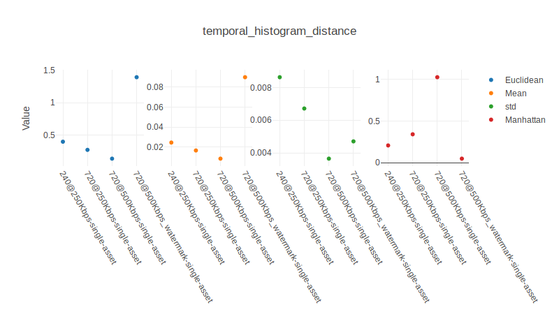

Time series aggregators for Inter-Frame Histogram Distance. Here only euclidean distance and mean behave similarly for more similar renditions. Manhattan distance and standard deviation show markedly different patterns not only for the watermarked rendition but also for the least distorted of 720p@500kbps.

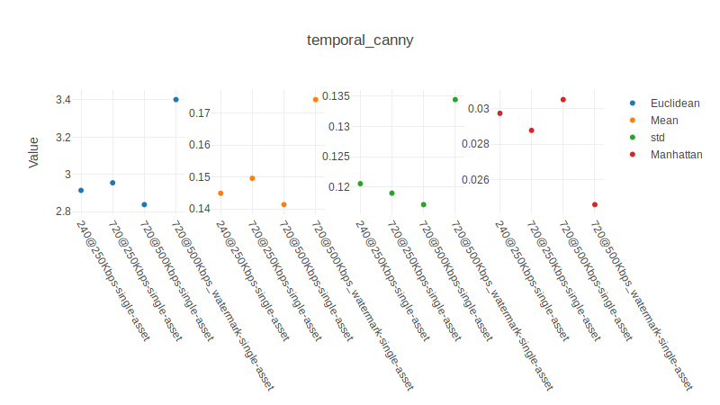

Time series aggregators for Inter-Frame Contour Difference. Looking at the time series above for this metric, we see all renditions running very close to each other (i.e. being similar). The aggregators however, distinguish fairly well what the watermark is.  For this asset and this metric, the extracted features are probably redundant with those of the temporal DCT, as the pattern is very similar between renditions (just different scale). This doesn't mean this will be the case for other assets.

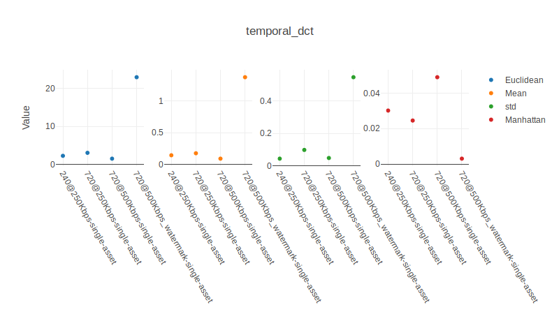

Time series aggregators for Inter-Frame DCT Difference. Observe how euclidean distance, mean and standard deviation of the time series, in their different scales, behave similarly for more similar renditions. However, the Manhattan distance shows a markedly different pattern for the watermarked rendition that will help further in uniquely characterizing this asset by our classifier. Other assets will show different patterns.

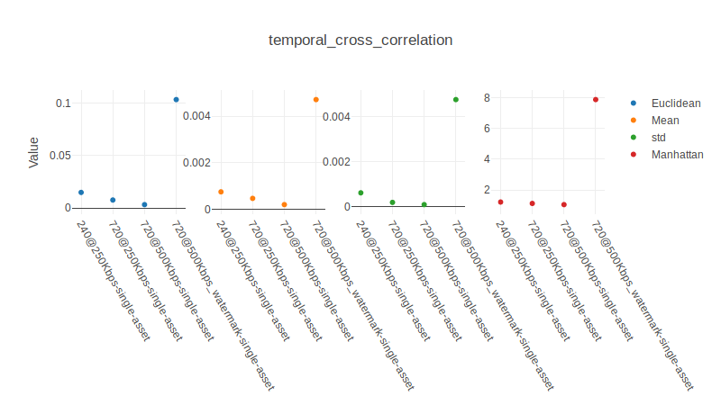

Time series aggregators for Inter-frame Normalized Cross-Correlation. In this metric, all analytics show similar patterns for different renditions, highlighting the difference of the watermarked rendition.

So, for a single asset, we may have found a fairly efficient set of alternatives to "classical metrics" such as PSNR, VMAF or SSIM. Our set offers a more contrasted difference between original and, for instance, watermarked renditions and other subtle attacks. And yes, they are fast to compute.
Eventually, our purpose is to be able to utilize this methodology with ANY asset and its renditions. Henceforth, we are in a position of assembling a rich feature vector for each one of our assets based on our sixteen values extracted from the spatial metrics and their temporal compilations.

#### Conclusions and further work

We have presented four spatial domain metrics that account for four different features of a frame:

- Color - Inter-Frame Histogram Distance (IFHD)
- Contours- Inter-Frame Contour Difference (IFCS)
- Energy- Inter-Frame Discrete Cosine Transform Difference (IFDCTD)
- Textures - Inter-frame normalized cross-correlation (IFNCC)

For each of those, we have assembled a time series from which we have extracted a summary of four different statistical metrics: 

- Euclidean distance from the original
- Mean
- Standard deviation
- Manhattan distance from the original

All together they compose a rich vector that is most suitable for feeding our Machine Learning Classifier.
Potentially, instead of using only these four time-domain aggregators, we could increase the amount of information supplied by using a histogram or, even better, the whole time series. However, for the first assault, we will keep things simple.
We will see their performance in a future story. Stay tuned!

#### References

[Livepeer](https://github.com/livepeer)

[Histogram Comparison](https://docs.opencv.org/2.4/doc/tutorials/imgproc/histograms/histogram_comparison/histogram_comparison.html)

[Canny Edge detector](https://en.wikipedia.org/wiki/Canny_edge_detector)

[Template Matching](https://opencv-python-tutroals.readthedocs.io/en/latest/py_tutorials/py_imgproc/py_template_matching/py_template_matching.html)

[DCT](https://en.wikipedia.org/wiki/Discrete_cosine_transform#Applications)

#### About the authors

[Rabindranath](https://www.epiclabs.io/member/rabindranath/) is PhD in
Computational Physics by the UPC and AI researcher. [Dionisio](https://www.epiclabs.io/member/dionisio/) is Computer Science Engineer by the UPM specialized in Media. [Ignacio](https://www.linkedin.com/in/ignacio-peletier-ribera/?locale=en_US) is a Telecommunications engineer currently specializing in Data Science and Machine Learning. They are part of [Epic Labs](https://www.epiclabs.io/), a software innovation center for Media and Blockchain technologies.

[Livepeer](https://livepeer.org/) is sponsoring this project with Epic Labs to research ways to evaluate the quality of video transcoding happening throughout the Livepeer network. This article series helps summarize our research progress.