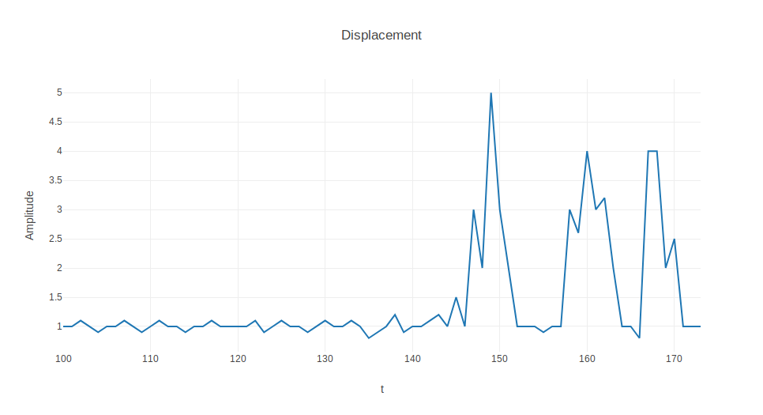

# Machine Learning for video transcoding verification in Livepeer’s ecosystem (IV)

> Livepeer is a protocol for video transcoding. Transcoding is a compute-heavy process that has traditionally carried a high technical and monetary cost. Livepeer aims to slash the cost of transcoding with an open network that incentivizes transparent competition among suppliers of transcoding capacity. The rules of the Livepeer protocol are backed by smart contracts on the Ethereum blockchain, an immutable ledger.
The combination of an open, permissionless network and immutable non-reversibility attracts byzantine (adversarial) behavior: any participant can attempt to “break the protocol” without immediate consequences from within the Livepeer network. A verification mechanism is necessary to decide whether the transcoding work was done correctly.

In a quest to define an algorithm that would help [Livepeer](https://livepeer.org/#) include such mechanism, we at [Epiclabs](https://www.epiclabs.io/) are making some progress (see [article I](https://medium.com/@epiclabs.io/assessing-metrics-for-video-quality-verification-in-livepeers-ecosystem-f66f724b2aea), [article II](https://medium.com/@epiclabs.io/assessing-metrics-for-video-quality-verification-in-livepeers-ecosystem-ii-6827d093a380) and [article III](https://medium.com/@epiclabs.io/assessing-metrics-for-video-quality-verification-in-livepeers-ecosystem-iii-744ba1c1d5d7)).

Summarizing, in the [first article](https://medium.com/@epiclabs.io/assessing-metrics-for-video-quality-verification-in-livepeers-ecosystem-f66f724b2aea) we introduced the problematics associated with common video metrics (PSNR, VMAF, SSIM, MS-SSIM, ...) and the simple aggregation of time series of these metrics into an average value. In [article II](https://medium.com/@epiclabs.io/assessing-metrics-for-video-quality-verification-in-livepeers-ecosystem-ii-6827d093a380), we presented alternative ways to tackle the associated oversimplifications. We introduced richer time-series aggregators such as the euclidean distance and also some alternative metrics that looked at differences between consecutive frames. Finally, in [article III](https://medium.com/@epiclabs.io/assessing-metrics-for-video-quality-verification-in-livepeers-ecosystem-iii-744ba1c1d5d7) we defined a rich set of five metrics that would look more carefully at specific characteristics of video frames.

In this first article of the series about machine learning we will explain how all these metrics can be used as inputs to a Binary Classifier and how they are being integrated within Livepeer's verification process.

## Supervised or unsupervised learning?

The answer: both.

In the problem at hand, our classifier is meant to establish whether a video encoding is done correctly. In the issues section of Livepeer's repo ([here](https://github.com/livepeer/verification-classifier/issues/1)) we read a more accurate description of what does that mean:

>Some possible attacks or unreasonable flaws in the video may include:
* Bitrate (eg, 720p output should not have a higher bitrate than an 1080p source [...])
* Rotations
* Watermarking, vignetting
* Color shifting, excessive color correction, filters
* Low quality encodes 

Extensive as it might seem, the list has to remain open, as the creativity of human beings is endless, more so when being part of a community and the incentive in high.
Our first approach was to naïvely create a large dataset of video encodings containing all the attacks in the list above, plus some others that we could imagine (full list is available [here](https://github.com/livepeer/verification-classifier/blob/master/scripts/README.md)). Soon it became apparent we were missing something: how many more attacks are we not considering?

By definition, when training a model through supervised learning for classification we must supply, for each training sample, with the category to which the sample belongs to (its label). This forces us to define beforehand all kinds of possible attack.

Enter unsupervised learning.

By contrast, training a classification model in an unsupervised manner basically means that the labels of the categories are not available. This is the case, for example, when a machine is operating for hours and hours undisturbed. Until it breaks down. If we were observing its every minute of running, we would have a lot of samples labeled as "it's working", but only one "it's broken" sample. Similarly, the labels available when bank or insurance fraud is being perpetrated are hard to obtain, as frauds often exploit vulnerabilities in the systems they attack that the designers weren't able to foresee.

In the absence of such valuable source of information, all we can resource to is "normality". By careful inspection of the supplied training data, unsupervised learning methods are able to extract common patterns that define what is normal behaviour, regarding as "novel", "outlier". Eventually, the outliers are determined from the "closeness" of vectors using some suitable distance metric.

...and finally, semi-supervised.

Half way between supervised and unsupervised learning lies the semi-supervised learning paradigm. In this case, as in unsupervised learning, what we will be modeling is only the normal behaviors. But it happens so that we have access to the labels.
As we decided to keep the categorization simple (attack / no attack), we just need to remove those labels and let the model figure out what is the boundary around the set of features we have created. We will use them for testing, though, but not in the training stage.

Moreover, we will prop up our system with yet another supervised learning classifier, so that new kinds of attacks can be learnt from and gain hindsight from the system's own experience.

Cool huh? At this point, hopefully, the advantage of our approach becomes evident: we can create a system that is robust to "any" kind of attack, even those "that we don't know that we don't know".

## Describing a video asset. What makes a good encoding?

This is great then. We have a strategy. But now we need to supply our learning model with enough information. The kind of information that helps it to figure out what makes it a "good" rendition so everything else can be categorized as garbage.
In our previous story ([article III](https://medium.com/@epiclabs.io/assessing-metrics-for-video-quality-verification-in-livepeers-ecosystem-iii-744ba1c1d5d7)) we described a set of computable features that seemed to describe fairly well the intrinsic characteristics of each one of our video samples. They describe inter-frame differences between renditions for:

* **Color** — Inter-Frame Histogram Distance (IFHD)
* **Contours** — Inter-Frame Contour Difference (IFCD)
* **Energy** — Inter-Frame Discrete Cosine Transform Difference (IFDCTD)
* **Textures** — Inter-Frame normalized cross-correlation (IFNCC)
* **Volume** — Inter -Frame Low Pass Difference (IFLPFD)

We also have a large enough data set created from the YT8M's dataset with original videos and different renditions. Instructions and utilites to access those 10 second video segments are available in the [project's repo](https://github.com/livepeer/verification-classifier). With an 80% train / 20% test split, we have **102531** train specimens and **25633** test specimens.
Our positive sample pool (i.e. "good" renditions), is made of those videos transcoded at the bitrate prescribed by Youtube according to their resolution (144p, 240p, 360p, 480p, 720p). The rest are attacks and belong to the negative pool.

This leaves us with **14550** positive training specimens and **87981** negative training specimen, from where we will only take **14550** in order to maintain a balanced dataset. Hopefully they will provide enough diversity to make a good generalization. The csv file containing the full dataset can be found [here](https://storage.googleapis.com/feature_dataset/data-large.tar.xz).

For the generation of this dataset, we have computed the following values for each and every sample:

* **resolution** (vertical size of the video, in pixels)
* **fps** (number of frames per second of the video)
* **size** (in memory, in bytes)
* **IFCD** (Inter-Frame Contour Difference between original and rendition, to observe and highlight contrasted regions)
  * Euclidean distance of the rendition's IFCD time series to that of its original
  * Manhattan distance of the rendition's IFCD time series to that of its original
  * Maximum value of the rendition's IFCD time series
  * Mean value of the rendition's IFCD time series
  * Standard deviation of the rendition's IFCD time series
* **IFNCC** (Inter-Frame Normalized Cross-Correlation, to observe structural distortions)
  * Euclidean distance of the rendition's IFNCC time series to that of its original
  * Manhattan distance of the rendition's IFNCC time series to that of its original
  * Maximum value of the rendition's IFNCC time series
  * Mean value of the rendition's IFNCC time series
  * Standard deviation of the rendition's IFNCC time series
* **IFDCTD** (Inter-Frame Discrete Cosine Transform Difference, to assess how much energy is lost between renditions)
  * Euclidean distance of the rendition's IFDCTD time series to that of its original
  * Manhattan distance of the rendition's IFDCTD time series to that of its original
  * Maximum value of the rendition's IFDCTD time series
  * Mean value of the rendition's IFDCTD time series
  * Standard deviation of the rendition's IFDCTD time series

* **IFLPFD** (Inter-Frame Low Pass Filter Difference, to assess volumetric differences between the original and the rendition)
  * Euclidean distance of the rendition's IFLPFD time series to that of its original
  * Manhattan distance of the rendition's IFLPFD time series to that of its original
  * Maximum value of the rendition's IFLPFD time series
  * Mean value of the rendition's IFLPFD time series
  * Standard deviation of the rendition's IFLPFD time series
* **IFHD** (Inter-Frame Histogram Distance between original and rendition, to observe color distortions)
  * Euclidean distance of the rendition's IFHD time series to that of its original
  * Manhattan distance of the rendition's IFHD time series to that of its original
  * Maximum value of the rendition's IFHD time series
  * Mean value of the rendition's IFHD time series
  * Standard deviation of the rendition's IFHD time series

This set of features is hopefully rich enough to describe in numerical terms all that a model needs to infer whether a transcoded video is a good or a bad copy of another.

# Learning machines

At last, with no more preambles, we can present the different techniques we have chosen to detect those nasty guys.

From the Unsupervised Learning side, we have invited to our party to One Class Support Vector Machine ([OCSVM](https://scikit-learn.org/stable/auto_examples/svm/plot_oneclass.html)) and Isolation Forest ([IF](https://scikit-learn.org/stable/auto_examples/ensemble/plot_isolation_forest.html)). From the Supervised Learning category, we have decided to count on Random Forest ([RF](https://scikit-learn.org/stable/auto_examples/ensemble/plot_random_forest_regression_multioutput.html#sphx-glr-auto-examples-ensemble-plot-random-forest-regression-multioutput-py)), AdaBoost ([AB](https://scikit-learn.org/stable/auto_examples/ensemble/plot_adaboost_twoclass.html)), Support Vector Machine ([SVM](https://scikit-learn.org/stable/modules/svm.html), no to be mistaken with OCSVM) XGBoost ([XGB](https://xgboost.readthedocs.io/en/latest/)) and an ad-hoc Neural Net (NN) designed by ourselves. We will not enter here in details about their implementations. They are available in the links provided and also in [our repository](https://github.com/livepeer/verification-classifier/tree/master/machine_learning/notebooks).

We will, instead, display our results with the above dataset and using those techniques. The choice is fairly arbitrary and a better informed reader might suggest better methods. For us, the tradeoff between ease of implementation and accuracy has been the main drive.

But first, let's define what our measure of success is. The image below is illustrative enough of what all binomial classifications are about.

By Walber - Own work, CC BY-SA 4.0, https://commons.wikimedia.org/w/index.php?curid=36926283

In our application, we can define true positives (**TP**) as all those videos that, being **correctly** transcoded, have been **correctly** identified as such by our model. Similarly, a true negative (**TN**) is any of those renditions that being **wrongly** transcoded have been **correctly** identified as such. On the other hand, we label false positives (**FP**) to those that being **wrongly** transcoded our model has defined like **correctly** transcoded. And finally, we have false negatives (**FN**) wherever a **wrongly** transcoded rendition is classified as **correctly** transcoded.

Given the nature of Livepeer's business, we have to be extremely careful with the first kind (TP). The system doesn't want to penalize those who, acting in good faith, may be mistakenly considered as bad. The main reason is that the proof of stake system would slash them and money would be lost. In other words, we want a very low False Negative Rate (*FNR*), or a true positive rate (*TPR*) as close to 1 as possible.

As a matter of fact, there is even certain tolerance to what can be *smuggled* as good while being bad (FP) because the system has other *organic* mechanisms than can deal with it. When a broadcaster identifies a misbehaving transcoder, chances are high that there will be no more business done and reputation will be lost (but not money).

So, our system needs to have a high True Positive Rate (TPR), but what about the accuracy?

The formula above seems solid. Accuracy is the ratio between all our correctly labeled samples and all the samples there are. 

# Results

#### References

[Livepeer](https://github.com/livepeer)

#### About the authors

[Rabindranath](https://www.epiclabs.io/member/rabindranath/) is PhD in
Computational Physics by the UPC and AI researcher. [Dionisio](https://www.epiclabs.io/member/dionisio/) is Computer Science Engineer by the UPM specialized in Media. [Ignacio](https://www.linkedin.com/in/ignacio-peletier-ribera/?locale=en_US) is a Telecommunications engineer currently specializing in Data Science and Machine Learning. They are part of [Epic Labs](https://www.epiclabs.io/), a software innovation center for Media and Blockchain technologies.

[Livepeer](https://livepeer.org/) is sponsoring this project with Epic Labs to research ways to evaluate the quality of video transcoding happening throughout the Livepeer network. This article series helps summarize our research progress.